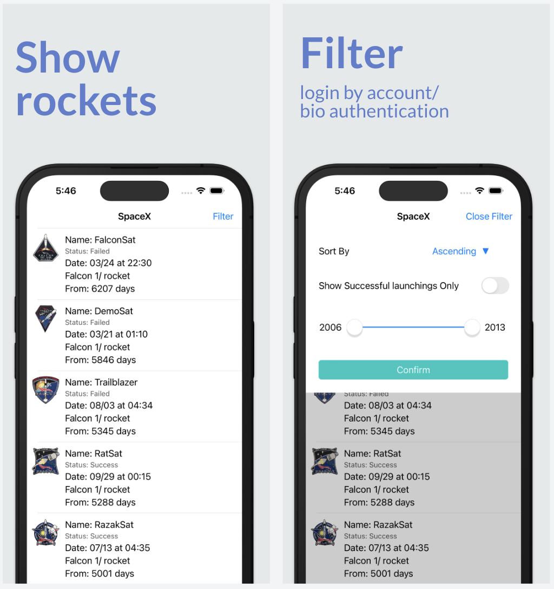

# SpaceX_VIPER
* With a third library MultiSlider (Swift Package Manager) using for filter dialog view (filter years)

## Requirements
- iOS 13.5+.

## Features
### UI Implementation
- Built the SpaceX screen with following two views
  - Present launching list
  - Filter dialog view
### API Data Fetching
- Get launching information and filter result by post API https://api.spacexdata.com/v4/launches/query
  - Pagination
  - Sort by ASC or DESC
  - Filter by Years
  - Filter by whether launching successfully
### Functions Implementation
  - Drag filter dialog view to dismiss
### Test Implementation
- Unit testing
- UI testing

## Technologies
- Swift
- Interface Builder(.xib)
- VIPER
- Paginating requests
- Image download asynchronously
- Interface Builder(.xib)
- POP (LocalizedStringType, Alertable)
- Image Cache (NSCache)
- Dependency Injection (DIContainer)
- Access Controls
- Unit testing
- UI testing
